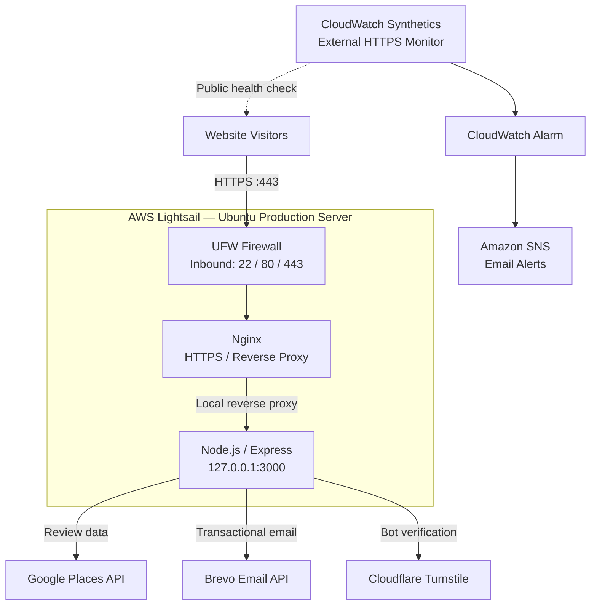

# All Over Janitorial Services Website

Production website and supporting cloud infrastructure developed for **All Over Janitorial Services, Inc.**

The project combines a responsive customer-facing website with a Node.js/Express backend, third-party service integrations, layered security controls, automated monitoring, and a hardened AWS Lightsail production environment.

**Live Site:** [www.alloverjanitorialservices.com](https://www.alloverjanitorialservices.com)

## Project Overview

The website provides customers with company information, service details, quote and contact forms, employment applications, and live Google review content.

Beyond the frontend, the project includes the production infrastructure required to securely host, monitor, update, and recover the application.

### Key Features

- Responsive multi-page business website
- Mobile navigation and responsive image carousel
- Contact and quote request forms
- Online employment application
- Google Reviews integration with server-side caching
- Automated email notifications through Brevo
- Cloudflare Turnstile bot protection
- Server-side form validation
- Global and endpoint-specific rate limiting
- SEO metadata and sitemap
- Custom 404 handling
- Application request logging

---

## Technology Stack

| Layer | Technologies |
|---|---|
| Frontend | HTML5, CSS3, JavaScript |
| Backend | Node.js, Express |
| Application Security | Helmet, Express Rate Limit, Cloudflare Turnstile |
| Integrations | Google Places API, Brevo Email API |
| Hosting | AWS Lightsail, Ubuntu Linux |
| Web / TLS | Nginx, Let's Encrypt, Certbot |
| Host Security | UFW, Linux file permissions |
| Monitoring | AWS CloudWatch, CloudWatch Synthetics, Amazon SNS |
| Source Control | Git, GitHub |

---

## Production Architecture

The application is hosted on an Ubuntu-based AWS Lightsail instance.

Public web traffic terminates at Nginx over HTTPS. Nginx operates as a reverse proxy and forwards application traffic internally to the Node.js/Express service.

The Node.js service listens exclusively on `127.0.0.1:3000`, preventing direct Internet access to the application port.

### Request Path

**Client → HTTPS → UFW → Nginx → Node.js/Express**

Only ports required for administration and web traffic are permitted through the host firewall. The application port remains accessible only through the server's loopback interface.

---

## Security

Security is implemented at both the application and infrastructure layers.

### Application Layer

- Secrets and credentials supplied through environment variables
- Production credentials excluded from source control
- Server-side input validation
- Cloudflare Turnstile verification
- Global request rate limiting
- Additional endpoint-specific rate limits
- Request body size restrictions
- Helmet HTTP security headers
- Dependency vulnerability auditing with `npm audit`

### Infrastructure Layer

- UFW default-deny inbound firewall policy
- Public exposure limited to SSH, HTTP, and HTTPS
- Node.js restricted to `127.0.0.1:3000`
- Nginx reverse proxy between the Internet and application service
- TLS 1.2 and TLS 1.3
- HTTP Strict Transport Security (HSTS)
- Nginx version disclosure disabled
- Let's Encrypt TLS certificates managed with Certbot
- Restricted production `.env` file permissions
- Automatic Ubuntu security updates
- Controlled system log retention

---

## Monitoring & Availability

Monitoring covers both the underlying infrastructure and the externally accessible website.

### Infrastructure Monitoring

AWS Lightsail metrics provide visibility into instance health and resource utilization.

### External Website Monitoring

CloudWatch Synthetics performs an HTTPS health check against the production website every five minutes.

A failed availability check can trigger:

**CloudWatch Synthetics → CloudWatch Alarm → Amazon SNS → Email Notification**

Because the check originates externally, it can detect website failures even when the Lightsail virtual machine itself remains operational.

This provides visibility into failures involving:

- HTTPS availability
- Nginx
- Node.js/Express
- Application responses

---

## Logging & Maintenance

The production server includes controls designed for long-term operation:

- Nginx access and error logging
- Daily Nginx log rotation
- Compressed historical logs
- systemd journal storage limits
- systemd journal retention limits
- Automatic Ubuntu security updates
- Node.js production dependency auditing

The application is managed as a systemd service so it automatically starts following a server reboot.

---

## Environment Configuration

Application configuration and credentials are supplied through environment variables.

`.env.example` documents the required configuration without exposing production credentials.

Environment variables are used for:

- Google Places API
- Cloudflare Turnstile
- Brevo Email API
- Email sender configuration
- Form recipient configuration

Production `.env` files are excluded from Git and stored directly on the production server with restricted file permissions.

**Production credentials, API keys, tokens, and passwords are never committed to the repository.**

---

## Deployment Workflow

GitHub serves as the source of truth for application code.

Changes follow a controlled deployment workflow:

**Local Development → Local Testing → Git Commit → GitHub → AWS Lightsail → Production Validation**

Application updates are developed and tested locally before being pushed to the `main` branch.

The production server retrieves approved changes from GitHub. Dependencies are synchronized and the AOJS systemd service is restarted when application changes require it.

Infrastructure-specific configuration is maintained independently from application source code, including:

- Nginx configuration
- UFW firewall rules
- TLS certificates
- systemd configuration
- Production environment variables

This separation prevents production secrets and host-specific configuration from entering the application repository.

---

## Backup & Recovery

The project uses separate recovery mechanisms for application code and production infrastructure.

### GitHub

Provides:

- Source control
- Commit history
- Change tracking
- Code rollback

### AWS Lightsail Snapshots

Provide full-instance recovery for the production environment, including the operating system and server configuration.

A known-good production snapshot is maintained following significant infrastructure changes.

---

## Production Validation

The production environment has been tested for:

- HTTPS availability
- Nginx reverse proxy operation
- Localhost-only Node.js binding
- UFW firewall persistence
- Automatic Nginx startup
- Automatic Node.js application startup
- Full server reboot recovery
- Google Reviews functionality
- Contact and quote form submission
- Employment application submission
- Transactional email delivery
- Cloudflare Turnstile verification
- External uptime monitoring
- SNS email alerting
- Production dependency vulnerability auditing

---

## Repository Security

This repository intentionally excludes:

- `.env`
- API keys
- Authentication tokens
- Production email credentials
- Server access credentials
- TLS private keys

Example configuration is provided through `.env.example` where appropriate.

---

## Author

**Tristan McMillin**